<!-- ═══════════════════════════════════════════════════════════════
     Rupom · GitHub profile README
     Setup: put this file AND the  folder in the root of your
     profile repo (a public repo named exactly like your username).
     Then replace every YOUR_* placeholder and every "Project name".
     ═══════════════════════════════════════════════════════════════ -->

<div align="center">


<br/>

<a href="https://skillicons.dev"></a>

<br/>

<sub><b>Currently learning C++ and Data Science</b> while exploring Physics, Electronics, Scientific Computing, IoT and Simulation</sub>


</div>

<br/>


<br/>

<table>
<tr>
<td width="55%" valign="top">

```text
Name        Rupom
field       Physics (undergraduate)
languages   C · C++ · Python
also        MATLAB · SQL · Power BI
builds      software × hardware
heading     computational science,
            data, technical development
```

</td>
<td width="45%" valign="top">

I like the moment where **mathematics, physics, code and hardware** meet: a numerical solver, a noisy lab dataset, a circuit on a breadboard.

I work on academic experiments, simulations, numerical methods, data projects and electronics.

</td>
</tr>
</table>


<div align="center">


</div>

<br/>


<br/>

<table>
<tr>
<td width="50%" valign="top">


- Modern C++ fundamentals
- Object-oriented programming
- Data structures and algorithms
- Problem solving
- Scientific and computational programming
- How C++ drives simulations and physics-based projects

</td>
<td width="50%" valign="top">


- Python for data analysis: **NumPy**, **Pandas**
- Data cleaning and wrangling
- Exploratory Data Analysis
- Statistics and data visualization
- **SQL**
- Regression and basic ML concepts
- Working with real-world datasets

</td>
</tr>
</table>

> 🎯 **Long-term goal:** a **physics simulation framework / physics engine**, built in C++.

<div align="center"></div>


<br/>

<table align = "center" >
<tr>
<td align="center" width="33%" valign="top">


**Code**<br/>
<sub>C · C++ <i>(learning)</i> · Python</sub>

</td>
<td align="center" width="33%" valign="top">


**Data and analysis**<br/>
<sub>MATLAB · SQL · Power BI · Python <i>(learning)</i></sub>

</td>
<td align="center" width="33%" valign="top">


**Hardware and workflow**<br/>
<sub>Electronics · IoT · Git · GitHub</sub>

</td>
</tr>
</table>

<div align="center"><sub>Scientific computing and numerical methods run through all three.</sub></div>

<br/>


<br/>

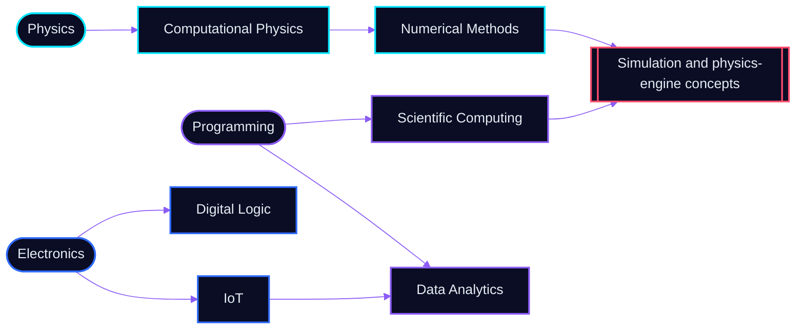

<div align="center"></div>


<br/>

<table align="center" width="100%">
<tr>
<td width="50%" valign="top">

### **🔬 Physics & Data Analysis**

**`Project Name`** <sub><b>What question does it answer?</b></sub>


**[↗ Project Link](https://github.com/YOUR_USERNAME/REPO)**

</td>

<td width="50%" valign="top">

### **🧮 Numerical Computation**

**`Project Name`** <sub><b>Which method, which problem?</b></sub>


**[↗ Project Link](https://github.com/YOUR_USERNAME/REPO)**

</td>
</tr>

<tr>
<td width="50%" valign="top">

### **🔌 Electronics**

**`Project Name`** <sub><b>What does the circuit do?</b></sub>


**[↗ Project Link](https://github.com/YOUR_USERNAME/REPO)**

</td>

<td width="50%" valign="top">

### **📡 IoT**

**`Project Name`** <sub><b>What does it sense or control?</b></sub>


**[↗ Project Link](https://github.com/YOUR_USERNAME/REPO)**

</td>
</tr>

<tr>
<td width="50%" valign="top">

### **⚙️ C / C++**

**`Project Name`** <sub><b>What are you building?</b></sub>


**[↗ Project Link](https://github.com/YOUR_USERNAME/REPO)**

</td>

<td width="50%" valign="top">

### **🐍 Python**

**`Project Name`** <sub><b>What does it do?</b></sub>


**[↗ Project Link](https://github.com/YOUR_USERNAME/REPO)**

</td>
</tr>

<tr>
<td width="50%" valign="top">

### **🌌 Simulation**

**`Project Name`** <sub><b>What system are you simulating?</b></sub>


**[↗ Project Link](https://github.com/YOUR_USERNAME/REPO)**

</td>

<td width="50%" valign="top">

### **🧠 Machine Learning**

**`Project Name`** <sub><b>What are you predicting or classifying?</b></sub>


**[↗ Project Link](https://github.com/YOUR_USERNAME/REPO)**

</td>
</tr>
</table>


<div align="center"></div>


<br/>

<div align="center">


</div>

<details>
<summary><b>Activity graph</b></summary>

<br/>

<div align="center">


</div>

</details>

<br/>


<br/>

<div align="center">

[](https://www.linkedin.com/in/YOUR_LINKEDIN)
[](mailto:YOUR_EMAIL)
[](https://github.com/Rupx2005)

<sub>Happy to talk physics, simulation, electronics, or anything that computes, oscillates or blinks.</sub>


</div>
